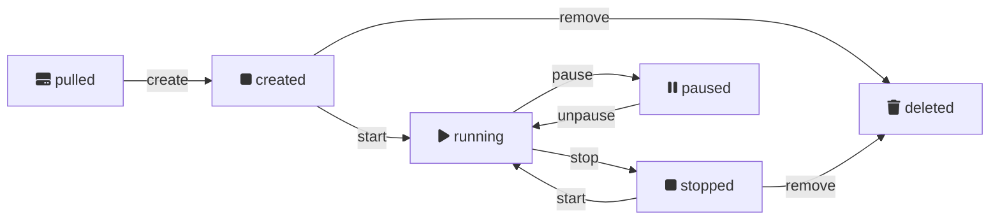

**[Course](../README.md)**
&emsp;[Study materials](#study-materials)
&emsp;[Homework assignment](./homework/README.md)

# Use container images

**Be able to use existing container images**

Hello everyone and welcome to the Docker course and its next learnig session.

Today we are going to create docker containers from existing container images and see how to manage them.

## Run Docker, run

Traditionally, any tutorial starts from a very simple example known as `Hello World`. Let's see how Docker supports this tradition.

```sh
docker run hello-world
```

The [docker run] command we have just applied has retrieved the container image, created the container from the image, executed the container, and printed out the container standard output.
BTW, the container output tells us about steps the Docker does under the hood.

Looking at the [docker run] command usage, we may conclude that to run a container from an existing image it is enough to specify only the image name.

But how docker knows were to get the image?

By default docker looks for an image in the publicly accessible library of images known as [Dockerhub].

In containers world we call such library an image `registry`. From its definition, a registry is a list of one kind of information, normally designating their items by an unique ID. So the conatiner image name must be unique withing its registry.

How do we know that docker indeed got the image from the registry when we issued the run command?

The command itself informed us about this.
```
Unable to find image 'hello-world:latest' locally
latest: Pulling from library/hello-world
70f5ac315c5a: Pull complete
```

As you can see it used not just name but put `library/` prefix on it, which is kind of an alias for default container images registry, which is [dockerhub] in our case.

But firstly, the command has informed us that it was unable to find the image locally. Which gives us a solid reason to assume that the Docker has such an important component as local image registry.

That is truly is. And we can look into the local registry by issuing the [docker images] command.

Let's try it.
```sh
docker images
```
> ```
> REPOSITORY    TAG       IMAGE ID       CREATED        SIZE
> hello-world   latest    b038788ddb22   6 months ago   9.14kB
> ```

> :memo: We can also get the list by `docker image ls` command.

The registry record corresponding to our image has `repository`, `tag` and `image id`.
As you can see repository is equal to the name that we specified for the [docker run] command. The `tag` is equal to `latest`, which is default value used when we omit tag in the image name. Аctually, when we are getting an image from a registry we specify not only its name but also the tag. Usually tag used to designate version or more generally speaking a flavor of the image.

Conjoinment of an image repository and a tag which we will call an image name designates the image in a remote registry, while the ID designates it in the local registry.

Often you will see images that have ID but have no name. Those untagged images are called dangling and are subjects for clean up commands.

There is also a common case when registry contains records with different names sharing one image ID, but not vice versa.

Let's try to run the same image once again.
```sh
docker run hello-world
```

As you can see there are no more messages regarding pulling the image. It's definitely because the image is already in our local registry.

You might ask what will happen if the image, we pulled from, has been modified between the two runs?

The short answer is nothing.
Docker won't pull the image again, and thus we will see no difference.

In order to run updated image we can use `--pull` option for the [docker run] command with its value set to `always`.

```sh
docker run --pull=always hello-world
```

> :memo: The `--pull` option must be placed before image name.

> ```
> latest: Pulling from library/hello-world
> Digest: sha256:c79d06dfdfd3d3eb04cafd0dc2bacab0992ebc243e083cabe208bac4dd7759e0
> Status: Image is up to date for hello-world:latest
> ```

> :memo: Possible values of the `--pull` are `allways`, `missing`, and `never`.

And now the messages about pulling are back again.
Docker has also informed us that the image has been updated from the particular repository and tag.

## Pull and bear

Of course it's not requried to run an image if we only want to pull it to our local registry.
We can do it by the [docker pull] command.

```sh
docker pull hello-world
```
> ```
> Using default tag: latest
> latest: Pulling from library/hello-world
> Digest: sha256:c79d06dfdfd3d3eb04cafd0dc2bacab0992ebc243e083cabe208bac4dd7759e0
> Status: Image is up to date for hello-world:latest
> docker.io/library/hello-world:latest
> ```

Onca again, the image has been updated.

As we already know, the Docker pulls image tagged as latest unless we explicitly specify the tag. And we also know that tag designates image version or flavor.
The [docker pull] comand has `--all-tags` flag which requests the Docker to download all tagged images in the repository.
Be carefull with the option because the list of tags might be too long.

Hierarchically images with unique tags belong to unique repository which belongs to a registry.

image | tag | repository | registry
|- |- |- |-
| alpine:latest | latest | alpine | dockerhub
| alpine:3.18.4 | 3.18.4 | $\textcolor{gray}{\text{alpine}}$ | $\textcolor{gray}{\text{dockerhub}}$
| alpine:edge | edge | $\textcolor{gray}{\text{alpine}}$ | $\textcolor{gray}{\text{dockerhub}}$
| alpine:20230901 | 20230901 | $\textcolor{gray}{\text{alpine}}$ | $\textcolor{gray}{\text{dockerhub}}$
| busybox:latest | latest | busybox | $\textcolor{gray}{\text{dockerhub}}$
| busybox:1.36 | 1.36 | $\textcolor{gray}{\text{busybox}}$ | $\textcolor{gray}{\text{dockerhub}}$
| busybox:1.35.0-uclibc | 1.35-uclibc | $\textcolor{gray}{\text{busybox}}$ | $\textcolor{gray}{\text{dockerhub}}$
| busybox:1.35.0-musl | 1.35-musl | $\textcolor{gray}{\text{busybox}}$ | $\textcolor{gray}{\text{dockerhub}}$

I might be wrong, but technically it's not required that completely different images must have different repository names. But practically it is not meaningful and has pitfalls. Logically the repository is a set of images that are different flavors of conceptually the same software component. Usually they are different versions built from different code modifications or images built from the same code but for different architectures or platforms.

Once the image is pulled to the local registry we can refer it by either its name or image id.

```sh
docker run b03
```

It is not necessary to specify the ID completely, it is enough to put only its first part that is uniquely distinguishes it from other ids in the registry.
> :memo: Even one symbol might be enough.

So far we talked mostly about images. It's time to look closely into containers.

Any container always does a specific task or runs a specific process.

The purpose of the simple container we use as an example is to print out the greeting message, confirming that our docker system works properly.

We can see our containers by listing them using [docker ps] command.

```sh
docker ps
```

Despite the fact that we did run the container several times we see no items in the list. But it doesn't mean that container is gone.

Docker by default doesn't show us containers that have completed their execution.
In order to see those containers we have to use `--all` flag in [docker ps] command.

```sh
docker ps --all
```
> ```
> CONTAINER ID   IMAGE                       COMMAND       CREATED          STATUS                       PORTS     NAMES
> 187d3ee2d324   b03                         "/hello"      15 seconds ago   Exited (0) 14 seconds ago              hardcore_feistel
> 27df7ad55c41   hello-world                 "/hello"      26 seconds ago   Exited (0) 26 seconds ago              gracious_poitras
> 7b9f30a51754   hello-world                 "/hello"      35 seconds ago   Exited (0) 34 seconds ago              peaceful_ganguly
> ec55874bfac4   hello-world                 "/hello"      42 seconds ago   Exited (0) 41 seconds ago              brave_dubinsky
> ```

We see that there are as many containers as many times we have applied docker run command.
It happens because each time we use the [docker run] command, docker creates a new container.

As well as for images the Docker maintains unique IDs for containers. Additionally, it generates unique human readable names. Those IDs and names are interchangeable in docker commands related to containers.

In our case all the containers that were created from `hello-world` image have ran to completion, which is shown by their statuses.

When we need to repeat the same actions, we don't have to create a new container by repeating the same [docker run] command, instead we can run the existing stopped container again.

Let's start the container that have completed its run earlier then others. We will use the [docker start] command.

```sh
docker start ec5
```

If you remember, when we used the [docker run] command it produced some output. But it didn't happen this time.

To see the output we have to use the `--attach` flag for the [docker start] command. It will attach our console to the container standard output.

Le's apply the [docker start] command several times. Then let's see the list of our containers.

```sh
docker start --attach ec5
docker start --attach ec5
docker start --attach ec5
```
```sh
docker ps -a
```
> ```
> CONTAINER ID   IMAGE         COMMAND    CREATED          STATUS                      PORTS     NAMES
> 187d3ee2d324   b03           "/hello"   44 minutes ago   Exited (0) 44 minutes ago             hardcore_feistel
> 27df7ad55c41   hello-world   "/hello"   44 minutes ago   Exited (0) 44 minutes ago             gracious_poitras
> 7b9f30a51754   hello-world   "/hello"   44 minutes ago   Exited (0) 44 minutes ago             peaceful_ganguly
> ec55874bfac4   hello-world   "/hello"   44 minutes ago   Exited (0) 4 seconds ago              brave_dubinsky
> ```

Obviously no new containers added to the list, and the run that was earliest became the latest.

When we ran the stopped container by means of the [docker start] command without adding `--attach` flag, we got no output back. But it doesn't mean that the output is gone. We can see it by using the [docker logs] command.

```sh
docker logs ec5
```

This log contains output from the several recent runs. Of course, the log has limitations and docker rotates it once the limit exceeded. According to information on the internet, by default, the local driver preserves 100MB of log messages per container.

The [docker logs] command can output timestamps for each log message, and allows to retrieve messages within a specified time range. Which is handy while debugging.

From the first sight, it seems that the [docker run] command and the [docker start] command are equal in behaviour, except that the first one creates a new container. But they are significantly different.

Let's look at the [docker run] command usage definitions it can show to us.

```sh
docker run
```
>```
> "docker run" requires at least 1 argument.
> See 'docker run --help'.
>
> Usage:  docker run [OPTIONS] IMAGE [COMMAND] [ARG...]
>
> Create and run a new container from an image
>```

As you can see, the command receives an optional command with a set of arguments for it.

For demonstration of the command option we will use image named `alpine` which is a secure, lightweight, and minimalist Docker image contains linux and its shell.

Let's run the following two commands wich will create and run a new container each.

```sh
docker run alpine echo hello
docker run alpine echo world
```

We use basic shell command `echo` which prints out the text we pass to it.

Let's see our containers list.

```sh
docker ps --all
```
> ```
> CONTAINER ID   IMAGE         COMMAND        CREATED         STATUS                     PORTS     NAMES
> d60bc6e917b6   alpine        "echo world"   6 minutes ago   Exited (0) 6 minutes ago             affectionate_morse
> d873334c9fd8   alpine        "echo hello"   6 minutes ago   Exited (0) 6 minutes ago             optimistic_wright
> ```

Now we have two additional stopped containers with its own command each.

The [docker start] command doesn't allow us to specify a command for the container, meaning it starts the container with already defined command.
Thus, we can conclude that the command together with its arguments is a container property. Once container has been created it keeps its command for lifetime. If we need to change the command we must create a new container.

## A long run

So far we were dealing with containers that do their job and stop. Let's try a long running container.

We are going to create a container running simple shell script that every second prints out increasing counter, starting from zero.

This time we won't rely on the docker on naming our new container, we will explicitly name it using `--name`` option of the [docker run] command.

```sh
docker run --name long-run alpine sh -c 'count=0; while true; do echo $count; sleep 1; count=$((count + 1)); done'
```

The Docker created and started container and attached our console to the container standard output.
Since this console is occupied, we have to use another console.

Let's list all running containers. This time we don't need the `--all` flag.
```sh
docker ps
```

We see there is the container named long-run with its status telling that it is up for some period of time.

Using docker we can control the running container. For instance, we can put it on pause.
```sh
docker pause long-run
```

We can then resume a paused container.
```sh
docker unpause long-run
```

When can stop a running container.
```sh
docker stop long-run
```

The stopping takes up to 10 seconds because the Docker tries to gracefully shutdown the container firstly by sending it special signal and only then forcibly stops the container.

We can terminate our container quicker by sending the interraption signal to the proccess running our script.

To do so we have to use the [docker exec] command which executes a command inside a running container. Of course, the command we are going to use must be suіtable for the container.

Let's start the long-run container again and stop it by sending it interraption signal via executing the kill command.

```sh
docker start --attach long-run
```
```sh
docker exec long-run kill -SIGINT 1
```

We noticed that this time the container was stopped much quicker.

The kill command we used in [docker exec] is not a docker command it is linux command that is siutable for our container running linux. The number 1 in the kill command designates a main container process wich is process that runs the container command we specified in the [docker create].

Using the [docker exec] we can apply any command on a running container.

## We count on you

As was mentioned, the [docker run] command creates and runs a container from an image and the [docker start] command starts already created container.
It is also possible to create a container without starting it.

Let's try this with our long-run container example but using a bit different approach.

Istead of specifiyng our script as a container command we will store it in a file.

```sh
echo 'count=${START:-0}
while true; do
  echo $count
  sleep 1
  count=$((count + 1))
done
' > instruction.sh
```

Then we ask the container to execute the script from this file.

```sh
docker create --name counter alpine sh /instruction.sh
```

Let's check the container command by using the `--filter` option allowing us to select a container with particular name.

```sh
docker ps --all --filter name=counter
```
> ```
> CONTAINER ID   IMAGE     COMMAND                CREATED         STATUS    PORTS     NAMES
> ccb0f5afe279   alpine    "sh /instruction.sh"   2 minutes ago   Created             counter
> ```

As you can see our container has proper command and status.
When we start the container it will run linux `shell` process that will read our script from the `instructions.sh` file.

But we have one problem here. The file resides in our host file system and we need it to be inside the container.

Let's try to start the container we have just created.
```sh
docker start --attach counter
```
> ```
> sh: can't open '/instruction.sh': No such file or directory
> ```
Indeed, the container didn't start because it couldn't find the file it refers to in its command.

We can solve it by using the [docker cp] command.
```sh
docker cp instruction.sh counter:/instruction.sh
```

The [docker cp] command has copied file from the local file system into container's file system.

We can do a reverse copy using the same command by changing the arguments order.
Thus, the [docker cp] command allows us to copy files into a container and from a container. And it doesn't matter if the container is running, paused or even stopped.

Let's start the container with attaching its standard output to our console.
```sh
docker start --attach counter
```

The container works as expected. So we can stop it.

```sh
docker exec counter kill -SIGINT 1
```

## One script fits all

What if we need to run the same counter script but start counting from any number?

We can modify our script for each particular case but it would be boring and even not feasible in real life applications. Instead we will make the counter start value parametrized so we won't need to modify the script every time we need a new value.

Fortunately, the [docker create] command allows us to pass a set of values that will be exposed as environment variables inside the container being created.

```sh
docker create --name counter-euler --env START=271828 alpine sh /instruction.sh
```

Frankly speaking, I've cheated a bit and wrote the script that already get the counter start value from the environment variable.

Since the container has its file system created from scratch, we have to copy our script file into container.
```sh
docker cp instruction.sh counter-euler:/instruction.sh
```

Let's start the container and see its output.
```sh
docker start --attach counter-euler
```

The container appears to be working fine and it correctly started counting from the value passed via environment variable.

Let's stop the container by sending it the interruption signal.
```sh
docker exec counter-euler kill -SIGINT 1
```

## Clean up after your docker

We know that when a container stopped it doesn't go away and docker keeps its file system. If we are not going to use the stopped container by any means than there is no need to spend resources on it. We use the [docker rm] command to remove a container and its resources from the system.

```sh
docker rm counter-euler
```

When we need to get rid of all stopped containers currently present in the docker system, we can use the [docker container prune] command.

```sh
docker container prune
```

The container image also consumes host system disk space. So, when we don't need the image anymore we can delete it by means of the [docker rmi] command.

```sh
docker rmi hello-world
```

In case we need to clean up entire docker system by getting rid of all stopped containers and all dangling images we use the [docker image prune] command.

```sh
docker image prune
```
It might be the command reports that no space was reclaimed meaning there were no dangling images.

The command also allows to remove not only dangling images but all images that are not used by any currently running container. To do this we use `--all` option.

```sh
docker image prune --all
```

## Container states and trasitions between them



## Epilogue

On today's session we went through process of containers creation using existing images. We saw how container can be started, stopped and started again. We used docker commands to copy files into container and execute actions inside the running container. We got acquainted with several ways of cleaning the docker system.

### [Homework](./homework/README.md)

## Study materials

[Basic Docker commands](https://capgemini.udemy.com/course/learn-docker/learn/lecture/7894010#overview)

[Docker run](https://capgemini.udemy.com/course/learn-docker/learn/lecture/7894016#overview)

[Command vs Entrypoint](https://capgemini.udemy.com/course/learn-docker/learn/lecture/12485580#overview)

[Docker engine](https://capgemini.udemy.com/course/learn-docker/learn/lecture/15829078#overview)

[Docker registry](https://capgemini.udemy.com/course/learn-docker/learn/lecture/15829070#overview)

[Docker registries](https://capgemini.udemy.com/course/docker-tutorial/learn/lecture/16122825#overview)

[Managing container images](https://capgemini.udemy.com/course/docker-tutorial/learn/lecture/15836320#overview)

## References

[Docker 101: Stop, Delete, and Manage Your Containers Like a Pro](https://intellisoft.io/docker-101-stop-delete-and-manage-your-containers-like-a-pro/#What_is_the_difference_between_Docker_kill_vs_stop_container_command)

[Docker: stop containers with the proper signals](https://kmg.group/posts/2022-05-23-docker-stop-containers-with-signals/)

[CLI tools you won't be able to live without](https://dev.to/lissy93/cli-tools-you-cant-live-without-57f6)

[docker container prune]: https://docs.docker.com/engine/reference/commandline/container_prune/
[docker cp]: https://docs.docker.com/engine/reference/commandline/cp/
[docker create]: https://docs.docker.com/engine/reference/commandline/create/
[docker exec]: https://docs.docker.com/engine/reference/commandline/exec/
[docker image prune]: https://docs.docker.com/engine/reference/commandline/image_prune/
[docker images]: https://docs.docker.com/engine/reference/commandline/images/
[docker logs]: https://docs.docker.com/engine/reference/commandline/logs/
[docker ps]: https://docs.docker.com/engine/reference/commandline/ps/
[docker pull]: https://docs.docker.com/engine/reference/commandline/pull/
[docker rm]: https://docs.docker.com/engine/reference/commandline/rm/
[docker rmi]: https://docs.docker.com/engine/reference/commandline/rmi/
[docker run]: https://docs.docker.com/engine/reference/commandline/run/
[docker start]: https://docs.docker.com/engine/reference/commandline/start/
[dockerhub]: https://hub.docker.com

---
**[Top](#)**
&emsp;[Course](/README.md)
<div align="right">[:loudspeaker: Report issue](https://gitlab.lohika.com/study/docker/way/-/issues/new)</div>
